# SFC-Fetch Workflows - Mermaid Diagrams

## 1. System Architecture Overview


## 2. Full Download Workflow


## 3. Daily Update Check Workflow

```mermaid
flowchart TD
    Start([Start Daily Check]) --> LoadIndex[Load index.json]
    LoadIndex --> LoadLastCheck[Load last-check.json]
    
    LoadLastCheck --> GetCurrentYear[Get current year]
    GetCurrentYear --> Search[POST /api/circular/search<br/>Current year, page 0]
    
    Search --> Compare{Compare with index}
    
    Compare --> NewCirculars{New circulars?}
    Compare --> Modified{Modified?}
    
    NewCirculars -->|Yes| ProcessNew[For each new circular]
    NewCirculars -->|No| CheckModified
    
    ProcessNew --> LogNew[Log: "NEW: {refNo}"]
    LogNew --> DownloadNew[Download full content]
    DownloadNew --> AddToIndex[Add to index]
    AddToIndex --> NotifyNew[Notify user]
    NotifyNew --> MoreNew{More new?}
    MoreNew -->|Yes| ProcessNew
    MoreNew -->|No| CheckModified
    
    CheckModified --> Modified
    Modified -->|Yes| ProcessMod[For each modified]
    Modified -->|No| UpdateTimestamp
    
    ProcessMod --> LogMod[Log: "MODIFIED: {refNo}"]
    LogMod --> ReDownload[Re-download content]
    ReDownload --> UpdateIndex[Update index entry]
    UpdateIndex --> NotifyMod[Notify user]
    NotifyMod --> MoreMod{More modified?}
    MoreMod -->|Yes| ProcessMod
    MoreMod -->|No| UpdateTimestamp
    
    UpdateTimestamp --> SaveCheck[Save last-check.json]
    SaveCheck --> GenerateReport[Generate check report]
    GenerateReport --> Complete([Check Complete])
    
    Complete --> Summary{Any updates?}
    Summary -->|Yes| SendNotification[Send notification]
    Summary -->|No| LogNoUpdates[Log: "No updates"]
    SendNotification --> End([End])
    LogNoUpdates --> End
```

## 4. Single Circular Data Flow

```mermaid
sequenceDiagram
    participant Client as sfc-fetch
    participant Search as /api/circular/search
    participant Content as /api/circular/content
    participant OpenFile as /api/circular/openFile
    participant OpenAppendix as /api/circular/openAppendix
    participant Storage as Local Storage

    Note over Client,Storage: Processing Circular 26EC6 (2026)

    Client->>Search: POST {year: 2026, pageNo: 0}
    Search-->>Client: {items: [{refNo: "26EC6", ...}]}

    alt Year >= 2012
        Client->>Content: GET ?refNo=26EC6&lang=EN
        Content-->>Client: {html: "<ol>...</ol>", ...}
        Client->>Storage: Save raw HTML
        Client->>Client: Convert HTML → Markdown
        Client->>Storage: Save Markdown
    end

    Client->>OpenFile: GET ?refNo=26EC6&lang=EN
    OpenFile-->>Client: [PDF binary data]
    Client->>Storage: Save PDF

    alt Has Appendix
        loop For each appendix
            Client->>OpenAppendix: GET ?refNo=26EC6&appendix=N&lang=EN
            OpenAppendix-->>Client: [PDF binary data]
            Client->>Storage: Save Appendix PDF
        end
    end

    Client->>Storage: Update index.json

    Note over Client,Storage: Circular 26EC6 Complete
```



## 5. Storage Index Structure


---

*Generated for sfc-fetch implementation*
