# SFC-Fetch Visual Workflow

## High-Level System Flow


## Circular Processing Detail

```mermaid
flowchart LR
    subgraph Discovery["Discovery Phase"]
        A[refNo from search]
    end
    
    subgraph TypeCheck{"Circular Type"}
        B{Check Year}
    end
    
    subgraph Modern["Modern (2012+)"]
        C[Get HTML]
        D[Save HTML]
        E[Convert MD]
        F[Save MD]
    end
    
    subgraph Legacy["Legacy (2000-2011)"]
        G[Skip HTML]
        H[Metadata only]
    end
    
    subgraph Common["Common Steps"]
        I[Get PDF]
        J[Save PDF]
        K{Has Appendix?}
        L[Download Appendix]
        M[Save Appendix]
        N[Update Index]
    end
    
    A --> B
    B -->|>= 2012| C
    B -->|< 2012| G
    
    C --> D
    D --> E
    E --> F
    G --> H
    
    D --> I
    F --> I
    H --> I
    
    I --> J
    J --> K
    K -->|Yes| L
    K -->|No| N
    L --> M
    M --> N
```

## Data Format Transformation

```mermaid
flowchart LR
    subgraph API["API Response"]
        A[HTML String]
        B[PDF Binary]
    end
    
    subgraph Processing["Processing"]
        C[Parse HTML]
        D[Extract Sections]
        E[Convert to Markdown]
    end
    
    subgraph Storage["File Storage"]
        F["📄 26EC6_raw.html"]
        G["📝 26EC6.md"]
        H["📑 26EC6.pdf"]
    end
    
    subgraph Usage["Usage"]
        I[Search/Index]
        J[Read Content]
        K[Archive]
    end
    
    A --> C
    C --> D
    D --> E
    
    A --> F
    E --> G
    B --> H
    
    F --> I
    G --> J
    H --> K
```



## Daily Check Sequence


## Year-by-Year Coverage


## Error Handling Flow


---

*Visual diagrams for sfc-fetch implementation guide*
